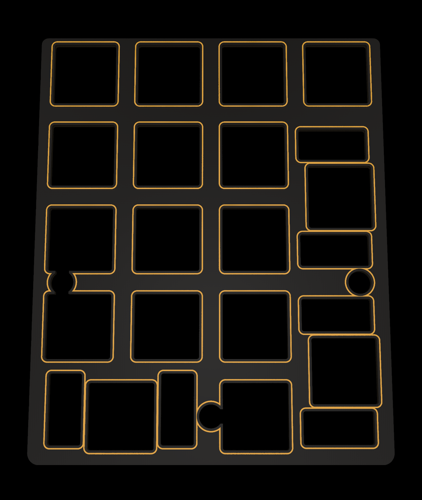

# RYCpad
[![CC BY-NC-SA 4.0][cc-by-nc-sa-shield]][cc-by-nc-sa]

**RYCpad rendered**

RYCpad (pronounced "ricey pad") is a custom mechanical keyboard numpad with through-hole components. It follows my other project [Axon](https://github.com/thatfellarobin/axon) in its emphasis on symmetric layout. RYCpad runs on an ATmega328P using VUSB and QMK.

RYCpad is designed to be printed with a black substrate PCB and clear solder mask, such as [OSHpark's After Dark service](https://docs.oshpark.com/services/afterdark/). There are no ground planes, allowing the traces to stand out. The plate and bottom PCB have windows in the solder mask to achieve a similar effect without the need for transparent solder mask.

### Resources and Config
The `.svg` file for laser-cutting an acrylic cover for the components can be found in `doc/`. For other materials, a `.dxf` is provided.

The `.svg` file for laser-cutting an acrylic rear plate is also provided in `doc/`. The rear plate is intended to be produced using transparent acrylic, to show off the main PCB. However, a rear plate "PCB" is provided.

A switch plate "PCB" is provided, but a `.dxf` can also be found in `doc/` for those who want to make it from a different material.

⚡⚠️ **Note:** `.svg` files account for a laser kerf of 0.2 mm, but the `.dxf` files do not account for any kerf. `.svg` files use green for cut lines, and blue for engraving.

\
**RYCpad switch plate "PCB"**

The indicator LED is controlled using [QMK's backlight feature](https://github.com/qmk/qmk_firmware/blob/master/docs/feature_backlight.md), which enables hardware PWM dimming in case you find the LED too bright.

### Component Libraries

**Symbols:**
- [Keyboard symbols by Hasu](https://github.com/tmk/kicad_lib_tmk)

**Footprints:**
- [Keyswitches by Daprice](https://github.com/daprice/keyswitches.pretty), but modified for my own tastes/uses.
- My own footprints for mostly decorative things. Can be found in `lib/`

## License
This work is licensed under a
[Creative Commons Attribution-NonCommercial-ShareAlike 4.0 International License][cc-by-nc-sa].

[![CC BY-NC-SA 4.0][cc-by-nc-sa-image]][cc-by-nc-sa]

[cc-by-nc-sa]: http://creativecommons.org/licenses/by-nc-sa/4.0/
[cc-by-nc-sa-image]: https://licensebuttons.net/l/by-nc-sa/4.0/88x31.png
[cc-by-nc-sa-shield]: https://img.shields.io/badge/License-CC%20BY--NC--SA%204.0-lightgrey.svg

If you have built upon this project and have significantly altered the design, the non-commercial clause can be waived with explicit permission.