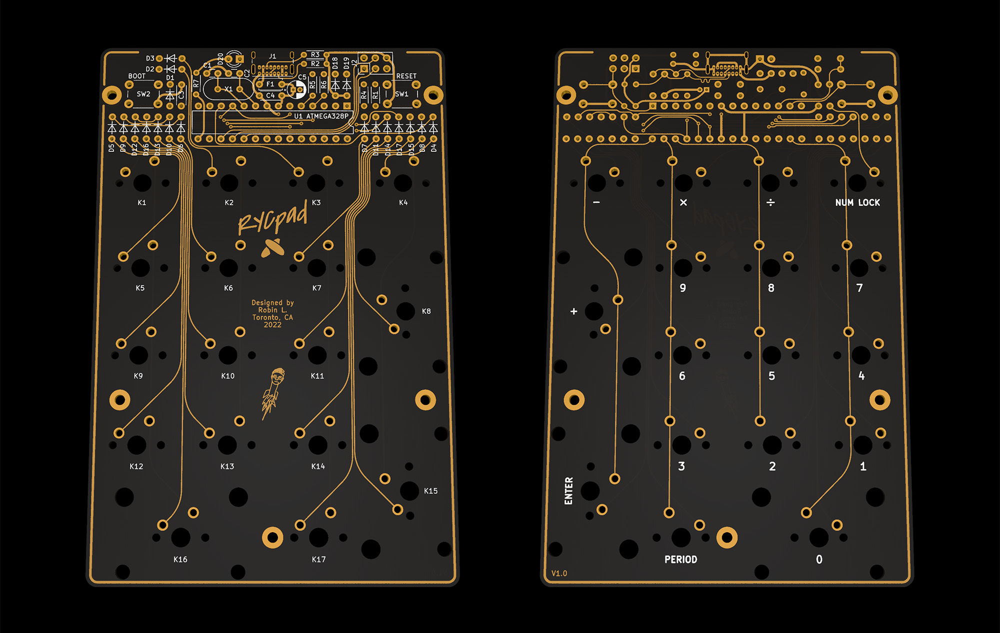

# RYCpad
[![CC BY-NC-SA 4.0][cc-by-nc-sa-shield]][cc-by-nc-sa]

**RYCpad rendered**

RYCpad (pronounced "ricey pad") is a custom mechanical keyboard numpad with through-hole components. It follows my other project [Axon](https://github.com/thatfellarobin/axon) in its emphasis on symmetric layout. RYCpad runs on an ATmega328P using VUSB and QMK.

RYCpad is designed to be printed with a black substrate PCB and clear solder mask, such as [OSHpark's After Dark service](https://docs.oshpark.com/services/afterdark/). There are no ground planes, allowing the traces to stand out. The plate and bottom PCB have windows in the solder mask, so they can be fabbed at cheaper PCB manufacturers but still have the exposed copper look.

### Resources and Config
The `.dxf` file for laser-cutting an acrylic cover for the components can be found in `doc/`. It will work fine as-is, but for best results the lines should be offset to account for the kerf of the specific laser being used. In my experience, an offset of 0.15 mm may be appropriate.

A plate "PCB" is provided, but the `.dxf` can also be found in `doc/` for those who want to make it from a different material.

\
**RYCpad plate "PCB"**

The indicator LED is controlled using [QMK's backlight feature](https://github.com/qmk/qmk_firmware/blob/master/docs/feature_backlight.md), which enables hardware PWM dimming in case you find the LED too bright.

### Component Libraries

**Symbols:**
- [Keyboard symbols by Hasu](https://github.com/tmk/kicad_lib_tmk)

**Footprints:**
- [Keyswitches by Daprice](https://github.com/daprice/keyswitches.pretty), but modified for my own tastes/uses.
- My own footprints for mostly decorative things. Can be found in `lib/`

## License
This work is licensed under a
[Creative Commons Attribution-NonCommercial-ShareAlike 4.0 International License][cc-by-nc-sa].

[![CC BY-NC-SA 4.0][cc-by-nc-sa-image]][cc-by-nc-sa]

[cc-by-nc-sa]: http://creativecommons.org/licenses/by-nc-sa/4.0/
[cc-by-nc-sa-image]: https://licensebuttons.net/l/by-nc-sa/4.0/88x31.png
[cc-by-nc-sa-shield]: https://img.shields.io/badge/License-CC%20BY--NC--SA%204.0-lightgrey.svg

If you have built upon this project and have significantly altered the design, the non-commercial clause can be waived with explicit permission.